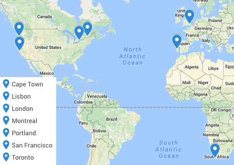

# Bruno Vieira's Résumé

> PhD student at Queen Mary University of London

 mail@bmpvieira.com  
  bmpvieira

## Events

As part of the 2016 Mozilla Fellows for Science program, I completed/participated in the following:

Event | Location | Date | Description | Role
----- | -------- | ---- | ----------- | ----
[Mozilla Fellows Offboarding]() | Toronto | 12-17th Jun, 2017 | Participant | 🙋
[Global Sprint](http://bit.ly/lxmozsprint) | Lisbon | 1st-2nd Jun, 2017 | Site host and participant | 📋 💻
[CSVconf](https://csvconf.com) | Portland | 2-3 May, 2017 | Demo about Bionode and participant | 👩‍🏫 💻 🙋
[MicroWOW at QMUL](https://www.eventbrite.co.uk/e/micro-working-open-workshop-git-and-github-tickets-6217345247) | London | 28 Apr, 2017 | Organizer | 📋
Turing Institute Tour | London | 28 Apr, 2017 | Visit and plan MicroWOW with Kirstie | 📷 📋
[London Node.JS User Group meetup](https://www.meetup.com/london-nodejs/events/235185234/) | London | 26 April, 2017 | [Talk about Bionode](https://youtu.be/p0v_uls8h-0) | 📢 📹
[Open Source Alliance for Open Science meeting](https://coko.foundation/open-source-alliance-for-open-science/) | Portland | 1 May, 2017 | [Participant](https://www.adamhyde.net/open-source-alliance-for-open-science/) | 🙋
[Mozilla Working Open Workshop](https://science.mozilla.org/programs/events/working-open-workshop-march-2017) | Montreal | 10-11th Mar, 2017 | Organizer and participant| 👩‍🏫 📋
[Bioinformatics Open Day](http://www.bioinformaticsopendays.com) | Braga | 22-24th Feb, 2017 | Workshop about Bionode | 👩‍🏫 📋
[MozFellows Workweek](https://science.mozilla.org/blog/mozfellows-workweek) | San Francisco | 6-10th Feb, 2017 | Participant | 🙋
[Digital Health Event in Machine Learning](http://innovatemedtec.com/events/digital-health-event-in-machine-learning/tab_speakers) | London | 7th Dec, 2016 | Participant | 🙋
[London Node.JS User Group (LNUG) meetup - Functional Extravaganza](https://www.meetup.com/london-nodejs/events/231423559/) | London | 23th Nov, 2016 | Participant | 🙋
[10th RA Fisher Centre Meeting](https://www.eventbrite.co.uk/e/10th-ra-fisher-centre-meeting-tickets-28249725690) | London | 10th Nov, 2016 | Participant | 🙋
[London Evolutionary Research Network (LERN) conference 2016](https://londonevolution.org/2016/10/13/lern-conference-2016/) | QMUL | 9th Nov, 2016 | Speaker | 📢
[Interactive biomolecular visualization & simulation using virtual reality on high-performance architectures by David Glowacki](https://goo.gl/photos/jhsrNHkxFL96VF9o6) | QMUL | Nov 4, 2016 | Participant | 🙋
[The Common Workflow Language (CWL) at the Bioinformatics London meetup](https://www.meetup.com/Bioinformatics-London/events/234989393/) | London | 3rd Nov, 2016 | Participant | 🙋
[Information is Beautiful Awards](http://www.informationisbeautifulawards.com/awards/2016) | London | 2nd Nov, 2016 | Participant | 🙋
[MozFest 2016](https://mozillafestival.org) | London | Oct 28-30, 2016 | [Talk](https://youtu.be/S4NP-wnWMss) ([slides](https://github.com/bmpvieira/fellows-class-2016/tree/master/bruno/MozFest/lightning-talk)) and [Workshop](http://try.bionode.io) about Bionode | 📢 📹 👩‍🏫 📋
[London Node.JS User Group (LNUG) meetup #57](http://www.meetup.com/london-nodejs/events/231423549/) | London | 26th Oct, 2016 | Participant | 🙋
[Publishing Better Science through Better Data](http://www.nature.com/openresearch/scidata16-presentations/) [#scidata16](https://twitter.com/#scidata16) | London | Oct 26, 2016 | Participant | 🙋
[Toward a neuro-computational account of skill acquisition by Merav Ahissar](https://goo.gl/photos/ve5UTmdVo3JWKkXQ6) | QMUL | 6th Oct, 2016 | Participant | 🙋
[The clonal evolution of cancer by Trevor Graham](https://goo.gl/photos/oXAmXy6p8stGvTec6) | QMUL | 29th Sep, 2016 | Participant | 🙋
[Mozilla Fellows Onboarding](https://science.mozilla.org/blog/2016-fellows-onboarding-recap) | Toronto | 12-15th Sep, 2016| Participant | 🙋

## Blogs
* Building you own super computer for Bioinformatics, 128 GB RAM (coming soon)
* A truly reproducible scientific paper? - practical example (coming soon)
* [How To Make Your GitHub Organization Project Board Public](https://medium.com/@bmpvieira/how-to-make-your-github-organization-project-board-public-fb5a243f28e4
)
* [Journey Into Becoming A Mozilla Science Lab Fellow](https://medium.com/@bmpvieira/brunos-journey-into-becoming-a-mozilla-science-lab-fellow-3f2f7f121001)
* [A truly reproducible scientific paper?](https://medium.com/@bmpvieira/a-truly-reproducible-scientific-paper-5059b282ee9a)
* [Introducing the 2016 Mozilla Science Fellows: Bruno Vieira](https://science.mozilla.org/blog/intro-to-bruno)

## Projects
TITLE | TECH USED | DESCRIPTION | ROLE
----- | --------- | ----------- | ----
[Bionode.io](http://bionode.io) | Node.JS / Bioinformatics | Community to build highly reusable tools and code for Bioinformatics using Node.JS | 💻
[GeoDiver](http://www.geodiver.co.uk) | Bionode and JavaScript | Coauthor on [paper](http://biorxiv.org/content/early/2017/04/15/127753) and poster presented at [BOSC 2017](https://www.open-bio.org/wiki/BOSC_2017) | 💻
[Study Group](https://bmpvieira.github.io/studyGroup/) | gh-pages | Started study group to organise events for Bioinformatics and Genomics in London, Lisbon and Toronto | 📋
[Zine about Open Science](https://github.com/bmpvieira/fellows-class-2016/tree/master/bruno/Zine) | Keynote / PDF | Idea started during fellowship onboarding and it was presented at MozFest 2016 | 🎨
[Bioinformatics data analysis super computer]() | Hardware, Linux, Win10 | 128 GB RAM, 6x4Ghz, 32 TB disk | 🔧
Mentored [EchoBust](https://github.com/TyJK/EchoBurst) and [Hydrogen](https://github.com/nteract/hydrogen) | GitHub & Hangouts |As part of the Open Leadership Training | 🎓
Google Summer of Code 2017 | GitHub & Hangouts | Co-mentored by [last year's student](https://github.com/thejmazz), to work on [bionode-watermill](http://github.com/bionode/bionode-watermill) | 🎓

## Grants
I applied to the following grants:

Stage | Funder | Description
----- | ------ | -----------
SUBMITTED | [Mozilla Science Mini-Grant](https://science.mozilla.org/blog/mini-grant-cfp) | Community management and events for Bionode.io
INTERVIEW | [Shuttleworth fellowship](https://shuttleworthfoundation.org) | To work on Bionode.io full-time
WON | [Google Summer of Code 2017](https://summerofcode.withgoogle.com) | Student co-mentored by 2016 student, to work on bionode-watermill, under the [OBF foundation](https://summerofcode.withgoogle.com/organizations/5447537956749312/)

## Networking
I met with or made significant connections with the following organizations and people:

* Regular chats with [Repositive.io](http://repositive.io) about organising hackathons and how they can use Bionode.io
* Met James Littlejohn (he came to the Bionode workshop at MozFest 2016). He wants to use blockchain and peer to peer technology combined with Bionode.io and Bento.bio to organise a citizen science genomics study. See: http://dsensor.org and https://youtu.be/aLhVFYSVo4Y
* Met with Michael R. Crusoe and discussed how Bionode.io could use CWL
* Got invited to teach Bionode to MSc student in U. Lisbon
* GSoC Student is in a lab that wants to use Bionode more (at Molecular Medicine Institute)

## Bionode
During my fellowship I learned how to better manage this community and what the funding landscape for open source projects like this looks like. I approached some funders and also attracted new contributors to this projects. We now need funding to support maintainers.

The following was developed during this fellowship:
* [Roadmap issue](https://github.com/bionode/bionode/issues/42)
* [Projects using Bionode](http://bionode.io/#Users)
* [Acknowledge all kinds of contributions](http://contributors.bionode.io)
* [Public organization wide project board](http://project.bionode.io)
* [Better contribution guidelines](https://github.com/bionode/bionode/blob/master/CONTRIBUTING.md)
* [Code of Conduct](http://contributor-covenant.org/adopters/)
* [Blog](https://medium.com/@bionode)
* [Better Documentation](http://doc.bionode.io)